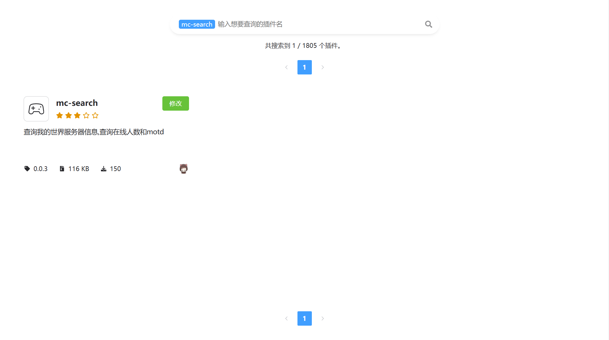
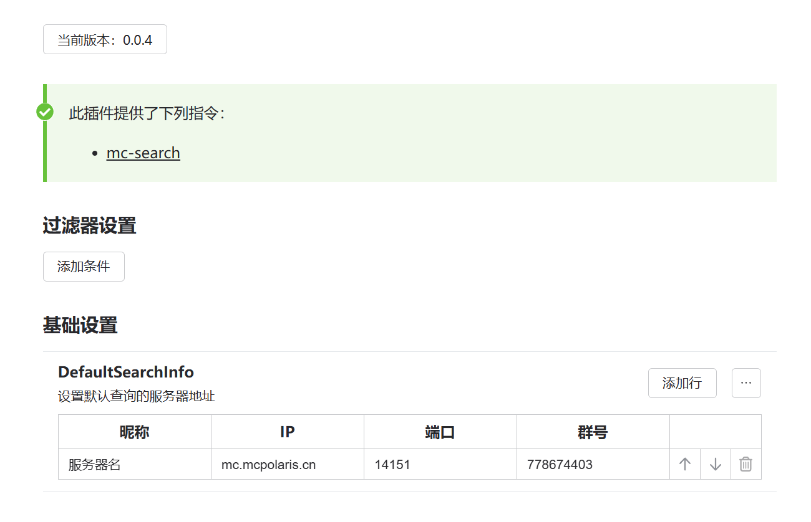

# koishi-plugin-mc-search

## 功能介绍 🚀
>
> 本插件为[Koishi](https://koishi.chat/zh-CN/)插件，插件提供了查询Java版MC服务器的功能，通过与服务器直接握手的形式进行查询，不依赖于现有API

## 使用教程💡

### 1. 插件市场搜索**mc-search**并订阅

### 2. 配置默认参数

这些参数都是可以自定义的，请按需定义

### 3. 使用指令

---

- 指令：``mc-search``

- 快捷指令：`查MC`

>  `查MC`：查询的是默认设置的房间，可以在配置插件页面自己配置，可以一个，也可以多个，查询内容跟设置中群组绑定，非设置群组查询不会回应

## 联系作者🔊

- QQ: `1549737287`
- QQ群: `778674403`